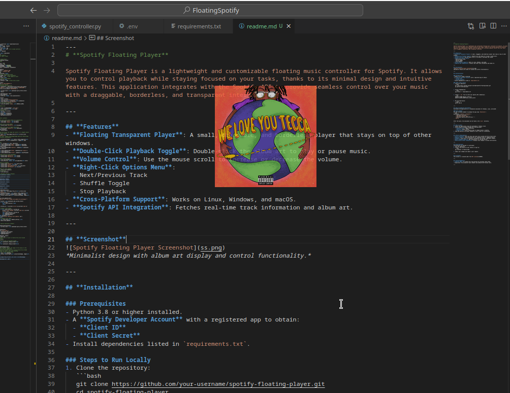
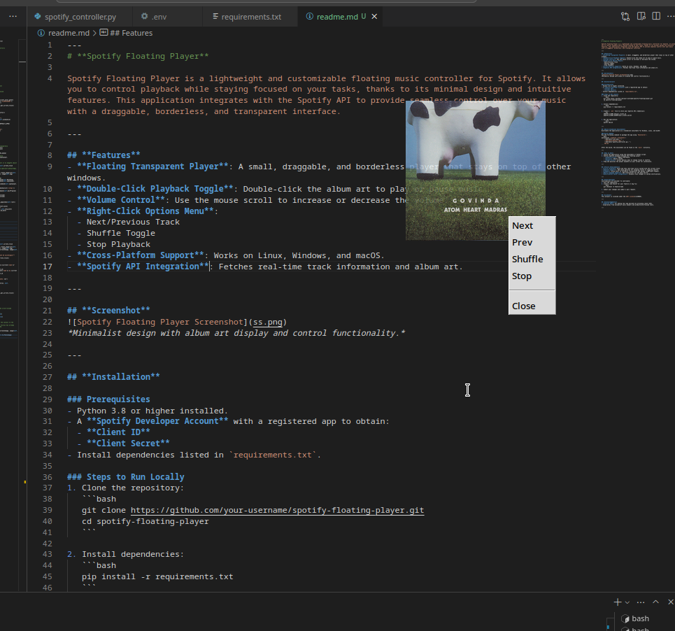

---
# **Spotify Floating Player**

Spotify Floating Player is a lightweight and customizable floating music controller for Spotify. It allows you to control playback while staying focused on your tasks, thanks to its minimal design and intuitive features. This application integrates with the Spotify API to provide seamless control over your music with a draggable, borderless, and transparent interface.

---

## **Features**
- **Floating Transparent Player**: A small, draggable, and borderless player that stays on top of other windows.
- **Double-Click Playback Toggle**: Double-click the album art to play or pause music.
- **Volume Control**: Use the mouse scroll to increase or decrease the volume.
- **Right-Click Options Menu**:
  - Next/Previous Track
  - Shuffle Toggle
  - Stop Playback
- **Cross-Platform Support**: Works on Linux, Windows, and macOS.
- **Spotify API Integration**: Fetches real-time track information and album art.

---

## **Screenshot**
  
*Minimalist design with album art display and control functionality.*

  
  
---

## **Installation**

### Prerequisites
- Python 3.8 or higher installed.
- A **Spotify Developer Account** with a registered app to obtain:
  - **Client ID**
  - **Client Secret**
- Install dependencies listed in `requirements.txt`.

### Steps to Run Locally
1. Clone the repository:
   ```bash
   git clone https://github.com/your-username/spotify-floating-player.git
   cd spotify-floating-player
   ```

2. Install dependencies:
   ```bash
   pip install -r requirements.txt
   ```

3. Create a `.env` file to store your Spotify API credentials:
   ```env
    CLIENTID="your-client-id-here"
    CLIENTSECRET="your-client-secret-id-here"
    REDIRECTURI="your-redirect-uri-here"
   ```

4. Run the application:
   ```bash
   python app.py
   ```

### Command-Line Arguments
You can customize the application using the following command-line arguments:
- `-s`, `--size`: Set the window size (default: 200).
  - Example: `python app.py -s 300`
- `-v`: Run the application in verbose mode.
  - Example: `python app.py -v`
- `-a`: Set the application's aplha (0 - 100).
  - Example: `python app.py -a 40`

---

## **Build Standalone Executable**
Distribute the application as a standalone executable for Windows, Linux, and macOS:

### Build Command
Run the following command to package the app using `PyInstaller`:
```bash
pyinstaller --onefile --noconsole \
    --add-data="icon.png:." \
    --add-data="default.jpg:." \
    --add-data="spotify_controller.py:." \
    app.py
```

After the build, the executable can be found in the `dist/` directory.

---

## **How to Use**
1. Launch the application using the executable or Python script.
2. Control Spotify playback through the floating player:
   - **Double-Click**: Toggle Play/Pause.
   - **Scroll**: Adjust volume.
   - **Right-Click**: Access options menu to change tracks or shuffle.
3. Drag and position the player anywhere on your screen for convenience.

---

## **Future Enhancements**
- **Lyrics Display**: Fetch and show real-time lyrics synced with the current track.
- **Gesture Support**: Add swipe gestures for skipping tracks or toggling shuffle.
- **Themes**: Allow users to customize transparency and design (light/dark themes).
- **Multi-Language Support**: Add translations for the menu and UI.
- **Notification Center Integration**: Display track changes in system notifications.

---

## **Contributing**
Contributions are welcome! To contribute:
1. Fork the repository.
2. Create a new branch for your feature or bug fix:
   ```bash
   git checkout -b feature-name
   ```
3. Commit your changes and submit a pull request.

---

## **License**
This project is licensed under the [MIT License](LICENSE).

---

## **Acknowledgments**
- **Spotify API**: For making this app possible by providing robust APIs.
- Inspiration from minimalist music players and productivity-focused tools.

---